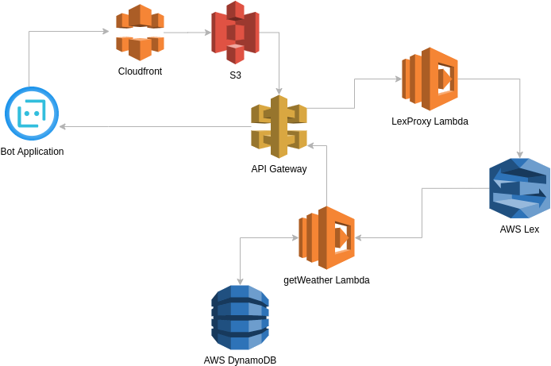
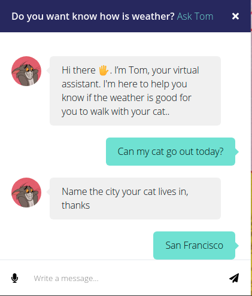
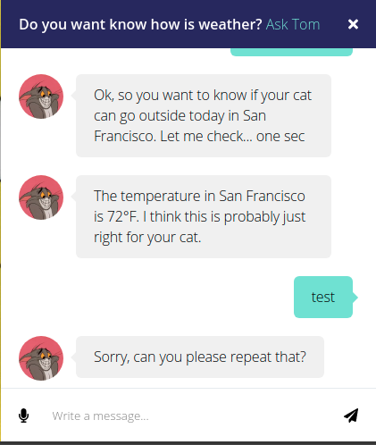
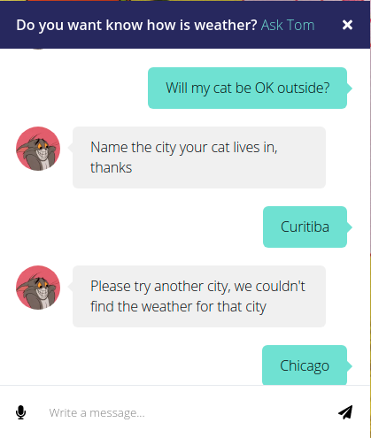
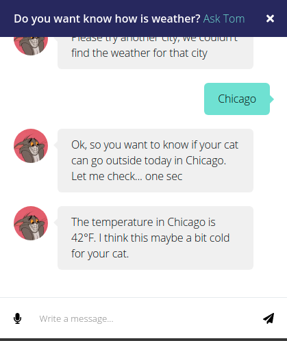

# react-aws-chatbot-app

Chatbot application developed using React, and the AWS Serverless services Lambda, API Gateway, Lex, S3, DynamoDB, 
and others services for didactic purposes on AWS Serverless training 
course [AWS: Building Serverless Applications](https://www.coursera.org/learn/aws-fundamentals-building-serverless-applications)

In this bot application, the user can send text or audio messages to communicate with the bot to ask about the weather in
some USA cities. to check which cities are available please check the [cities.csv](aws/dynamodb/cities.csv) file. 
The Dynamo database has been seeded by this file.

## TODO:
 - Finish the documentation

### AWS Services

- **S3** - Where the build static website has been hosted, to know more how host a static website on s3, please check:
[Hosting a static website on Amazon S3](https://docs.aws.amazon.com/AmazonS3/latest/dev/WebsiteHosting.html)
- **Cloudfront** - The CDN service used to serve the build site, to understand how to use CloudFront to serve a static 
website hosted on Amazon S3, please check: 
[How do I use CloudFront to serve a static website hosted on Amazon S3](https://aws.amazon.com/premiumsupport/knowledge-center/cloudfront-serve-static-website/)
- **API Gateway** - The service used to create the REST API to integrate the application with the Lambda Functions, Lex service, and the
DynamoDB database. To understand how to build an API Gateway REST API with Lambda integration check: 
[Build an API Gateway REST API with Lambda integration](https://docs.aws.amazon.com/apigateway/latest/developerguide/getting-started-with-lambda-integration.html)
- **Lambda** - The serverless functions that 

 
**Simple architecture diagram**

### How to use

Download and install the Node.Js and NPM using the [NVM](https://github.com/creationix/nvm).

Clone the repository and install the node modules.

`npm install`

After this, you can run the application.

***

#### Running the application

You can use the Npm to serve this application.

To do this on the root of the project, use the `npm start` command.

Then navigate your browser to http://localhost:3000 to see the app running in your browser.

---                   |  ---
:-------------------------:|:-------------------------:
| 
| 

#### Building application

This application uses the [create-react-app](https://create-react-app.dev/docs/getting-started/) to do build the project 
build.

To run the build, on the root of the project use:

    npm run build

